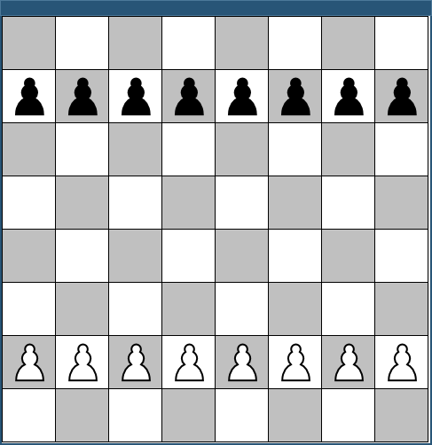
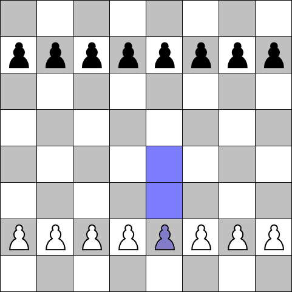

# Hintergrund

Über die nächsten 3 Aufgaben hinweg üben Sie das Erstellen von GUIs und einige Pattern der objektorientierten Softwareentwicklung. Dabei entwickeln Sie die Basis für ein Schachspiel. Die Aufgaben beinhalten nur die reine Basis - wenn Sie Spaß daran haben, können Sie aber diese Basis beliebig für Erweiterungen nutzen und sie sogar, je nach Umfang, zu einem Projekt für das Semester ausbauen.

Für die Bearbeitung werden Sie einige Java-Standard-Klassen verwenden, die in der Vorlesung nicht im Detail besprochen wurden. Verwenden Sie, um ein Gefühl für deren Einsatzmöglichkeiten zu bekommen, die [Java-Dokumentation](https://docs.oracle.com/en/java/javase/26/) und/oder Google. Niemand kennt alle Standard-Klassen aus dem Kopf - Wissen ist hier wirklich wissen wo was steht.

# JLabel-basiertes UI

In den ersten zwei Aufgaben bauen Sie ein Schachbrett aus `JLabel`-Objekten auf. Bevor wir uns dem UI zuwenden, müssen Sie allerdings erst die Basisklassen aufbauen, die die Informationen über das Schachbrett und die Figuren darauf enthalten.

## Pieces

Implementieren Sie dafür zunächst im Paket `chess.pieces` die folgenden Klassen:

### ChessSprite

Die abstrakte Klasse `ChessSprite` bildet die Basis für alle grafischen Elemente in dem Spiel: Die Figuren und die Felder auf dem Schachbrett. Sie soll ein `enum` mit dem Namen `Color` und den Werten `WHITE` und `BLACK` sowie folgende Methoden und Attribute haben:

#### Attribute

- `protected int boardX`: Die X-Koordinate auf dem Schachbrett (zwischen 0 und 7)
- `protected int boardY`: Die Y-Koordinate auf dem Schachbrett (zwischen 0 und 7)
- `private boolean highlighted`: Zeigt an, ob das Element hervorgehoben ist (z.B. wenn die Maus sich darüber befindet)
- `private ImageIcon normalIcon`: Das ImageIcon, welches normalerweise zur Darstellung verwendet wird
- `private ImageIcon highlightedIcon`: Das ImageIcon, welches zur Darstellung eines hervorgehobenen Elements verwendet wird

#### Methoden

- `public ChessSprite(String imagefile, String highlightedImageFile, int boardX, int boardY)`: Constructor. Die beiden Strings sind die Dateinamen der Bilder für die `ImageIcon`s
- Getter und Setter für die Attribute `boardX`, `boardY` und `highlighted`
- Getter für die beiden `ImageIcon`
- `public ImageIcon getCurrentIcon()`: Gibt je nach Wert von `highlighted` das entsprechende `ImageIcon` zurück

### ChessField

Das `ChessField` repräsentiert ein Feld auf dem Schachbrett. Es leitet von `ChessSprite` ab und hat als einzige Methode einen Constructor `public ChessField(int x, int y, ChessSprite.Color color)`. Dieser ruft den super-Constructor auf mit den korrekten Pfaden für die Bilder für die Darstellung, je nachdem ob `color` `WHITE` oder `BLACK` ist.

Die Bilder für die Darstellung finden Sie im Ordner `resources`. Die zwei Buchstaben nach "Chess_" zeigen Ihnen an, was in der Datei ist: Der erste Buchstabe welche Sorte Element es ist (z.B. "f" für "Feld"), der zweite die Farbe ("d" = dark, "l" = light, "a" = active/highlighted).

### ChessBoard

Implementieren Sie nun eine Klasse `ChessBoard`, welche ein Spielfeld darstellen soll. Später fügen wir hier Figuren hinzu, aber zunächst stellen Sie nur das Brett dar.

Die Klasse soll die folgenden Methoden und Attribute enthalten:

#### Attribute

- `private ChessField[][] fields`: Ein 2-dimensionales Array, welche die 8x8 `ChessField`-Objekte für das Schachbrett enthält

#### Methoden

- `public ChessBoard()`: Ein Constructor, der das Schachbrett initialisiert: `fields` wird mit `ChessField`-Objekten der korrekten Farben (`BLACK` und `WHITE` im Schachbrett-Muster) befüllt.
- Getter für `fields`

## JComponent-basiertes UI

Nun erstellen Sie im Paket `chess.ui` eine Klasse für die Darstellung des Brettes.

### PieceLabel

Um ein konkretes Element des `ChessBoard` (`ChessSprite`s: Felder und Figuren) darzustellen, verwenden wir `JLabel`. Damit diese "wissen", zu welchem `ChessSprite` sie gehören, implementieren wir eine eigene, abgeleitete Klasse.

Erstellen Sie dafür im Paket `chess.ui.componentui` eine Klasse `PieceLabel`, die von `JLabel` ableitet. Sie soll folgende Attribute und Methoden enthalten:

#### Attribute

- `private ChessSprite sprite`: Das `ChessSprite`, welches von diesem Label dargestellt wird

#### Methoden

- `public PieceLabel(ChessSprite sprite)`: Constructor.
- Getter für `sprite`
- `public void updateIcon()`: Setzt das aktuelle Icon des Labels auf das aktuell korrekte Icon des enthaltenen `ChessSprite`. Da das etwas schwer zu verstehen ist: Es ist einfach diese Code-Zeile gemeint: `setIcon(sprite.getCurrentIcon())`. `getCurrentIcon()` haben Sie in `ChessSprite` selber implementiert. Schauen Sie in der Dokumentation nach, was `setIcon()` in `JLabel` macht.

An dieser Stelle können Sie erstmals die Darstellung testen. Sie könnten dafür beispielsweise eine Klasse `WindowTest` im Paket `chess` mit dem folgenden Code erstellen:

```java
package chess;
import chess.pieces.ChessSprite;
import chess.ui.componentui.PieceLabel;

import javax.swing.*;
import java.awt.*;

public class WindowTest extends JFrame {
    public WindowTest() {
        setDefaultCloseOperation(EXIT_ON_CLOSE);
        setSize(new Dimension(8*60, 8*60));
        ChessSprite testSprite = new ChessSprite("resources/Chess_pdt60.png", "resources/Chess_pat60.png", 0, 0);
        PieceLabel testLabel = new PieceLabel(testSprite);
        add(testLabel);
    }
    public static void main(String[] args) {
        new WindowTest().setVisible(true);
    }
}
```

Sie müssten ein Fenster mit einem schwarzen Bauern sehen. Sie können auch probieren, den Testcode so anzupassen, dass mehrere unterschiedliche Figuren angezeigt werden. 

### GamePanel

Erstellen Sie nun im Paket `chess.ui` eine abstrakte Klasse `GamePanel` (abstrakt, weil wir später eine alternative konkrete Implementation machen werden). Diese soll von `JPanel` ableiten und die folgenden Methoden und Attribute enthalten:

#### Attribute

- `private ChessBoard board`: Das Schachbrett
- `private int fieldSize`: Die Größe eines Feldes. Sinnvollerweise sollte dies der Seitenlänge der Bilder entsprechen (hier 60 Pixel)

#### Methoden

- Getter für `board` und `fieldSize`
- `public GamePanel(int fieldSize)`: Constructor, der ein neues `ChessBoard` initialisiert. Setzen Sie hier auch die Dimensionen des Panels mit `setSize(new Dimension(8*this.getFieldSize(), 8*this.getFieldSize()))` (und schauen Sie in der Java-Dokumentation nach, was `setSize` in `JPanel` macht).
- `public abstract void updateGUI()`: Wird in konkreten Implementationen überschrieben, um alles zu tun, was nötig ist, um die grafische Darstellung zu aktualisieren, wenn sich Dinge ändern.

### ComponentsGamePanel

Erstellen Sie im Paket `chess.ui.componentui` eine Klasse `ComponentsGamePanel`, die von `GamePanel` (und damit indirekt von `JPanel`) ableitet und ein ganzes Schachbrett darstellt. 

Hinweis: Sie werden hier ein absolutes Layout in dem `JPanel` verwenden müssen. Probieren Sie zunächst den folgenden Code aus in einer neuen Klasse `AbsoluteWindowTest` im Paket `chess` aus, um zu vestehen, wie das absolute Layout funktioniert (Kernelemente hierbei sind das `setLayout(null)`, welches den `LayoutManager` deaktiviert und somit absolute Positionierung erlaubt, und das `setBounds(x, y, width, height)`, welches für eine `JComponent` die Position und die Größe definiert):

```java
package chess;

import chess.pieces.ChessSprite;
import chess.ui.componentui.PieceLabel;

import javax.swing.*;
import java.awt.*;

public class AbsoluteWindowTest extends JFrame {
    private class AbsolutePanel extends JPanel {
        public AbsolutePanel() {
            setLayout(null);
            setSize(new Dimension(8*60, 8*60));
            ChessSprite testSprite = new ChessSprite("resources/Chess_pdt60.png", "resources/Chess_pat60.png", 0, 0);
            PieceLabel testLabel = new PieceLabel(testSprite);
            testLabel.setBounds(10, 10, 60, 60);
            add(testLabel);
            testSprite = new ChessSprite("resources/Chess_plt60.png", "resources/Chess_pat60.png", 0, 0);
            testLabel = new PieceLabel(testSprite);
            testLabel.setBounds(80, 120, 60, 60);
            add(testLabel);
        }
    }
    public AbsoluteWindowTest() {
        setDefaultCloseOperation(EXIT_ON_CLOSE);
        setSize(new Dimension(8*60, 8*60));
        add(new AbsolutePanel());
    }
    public static void main(String[] args) {
        new AbsoluteWindowTest().setVisible(true);
    }
}
```

Probieren Sie etwas rum: Fügen Sie neue Sprites hinzu, ändern Sie die Positionen etc., bis Sie verstehen, wie das absolute Layout funktioniert.

Implementieren Sie dann in der Klasse `ComponentsGamePanel` die folgenden Attribute und Methoden:

#### Attribute

- `private ArrayList<PieceLabel> labels`: Liste aller `PieceLabel` für die Elemente, die auf dem Schachbrett dargestellt werden sollen

#### Methoden

- `public void updateGUI()`: Leere Methode, die vorerst noch nichts tut
- `public ComponentsGamePanel(int fieldSize)`: Constructor. Dieser soll den super-Constructor aufrufen, wodurch Sie ein fertig initialisiertes `ChessBoard` bekommen. Dann soll für jedes `ChessField` des `ChessBoard` (an welches Sie über die Methode `getBoard()` rankommen, welche Sie selber vorher in `GamePanel` implementiert haben) ein neues passendes `PieceLabel` erstellt werden. Diese `PieceLabel` sollen mit der `add()`-Methode (wie in dem Beispiel `AbsoluteWindowTest`) dem `ComponentsGamePanel` an der jeweils korrekten Stelle hinzugefügt werden.

Sie können nun eine Hauptklasse implementieren, um das Spielfeld zu testen, beispielsweise `ChessGame` im Paket `chess` mit dem folgenden Code:

```java
package chess;

import chess.ui.componentui.ComponentsGamePanel;

import javax.swing.*;
import java.awt.*;

public class ChessGame extends JFrame {
    public ChessGame() {
        setDefaultCloseOperation(EXIT_ON_CLOSE);
        setSize(new Dimension(60*8+10, 60*8+10));
        add(new ComponentsGamePanel(60));
    }
    public static void main(String[] args) {
        new ChessGame().setVisible(true);
    }
}
```

Sie sollten, wenn Sie dieses Programm starten, ein Fenster sehen, das in etwa so aussieht:


### ChessPiece

Um das Spiel um Figuren zu erweitern, benötigen Sie eine Klasse, die eine Figur beschreibt. Implementieren Sie dafür eine abstrakte Klasse `ChessPiece`, die von `ChessSprite` ableitet - sie stellt auch Dinge dar, die auf dem Spielbrett sein können, muss aber über etwas andere Funktionalität verfügen, als das `ChessField`:

#### Attribute

* `private Color color`: Die Farbe der Figur
* `private ChessBoard board`: Das Schachbrett - das benötigen Sie nachher, um zu überprüfen, wo eine Figur hin ziehen darf

#### Methoden

* `public ChessPiece(ChessBoard board, String imagefile, String mouseOverImageFile, int x, int y, Color color)`: Constructor. Wie beim `ChessField` ruft er den `super`-Constructor mit den übergebenen Bildern auf, zusätzlich setzt er das `ChessBoard`.
* `public Color getColor()`: Getter für `color`.
* `public abstract boolean canMoveTo(int x, int y)`: Gibt `true` zurück, falls die Figur an die übergebene Position auf dem Schachbrett ziehen kann, sonst `false`. Die konkrete Logik hängt davon ab, um welche Figur es sich handelt, daher ist diese Methode abstrakt und wird von den konkreten Figur-Klassen überschrieben (wie z.B. `Pawn`, welche Sie als nächstes implementieren).

### Pawn

Nun können Sie das Spiel um Figuren erweitern. Sie fangen mit Bauern an, um das Konzept zu verstehen. Wenn Sie wollen, können Sie später beliebit weitere Figuren hinzufügen.

Implementieren Sie hierfür eine Klasse `Pawn`, die von `ChessPiece` ableitet. Sie soll die folgenden Methoden haben:

* `public Pawn(ChessBoard board, int x, int y, ChessSprite.Color color)`: Constructor. Ruft den `super`-Constructor mit den korrekten Bilddateien auf ("Chess_pdt60.png" für den schwarzen Bauern, "Chess_plt60.png" für den weißen Bauern, und als "highlighted"-Bild in beiden Fällen "Chess_pat60.png")
* `public boolean canMoveTo(int x, int y)`: Überschreibt die abstrakte Methode aus `ChessPiece` entsprechend der Schachregeln: Bauern können nur 1 oder 2 Felder nach Vorne gehen (wenn die Farbe Schwarz ist also nur die y-Koordinate um 1 oder 2 erhöhen, wenn die Farbe Weiß ist die y-Koordinate um 1 oder 2 verringern). Sollten Sie später das Spiel erweitern, könnten Sie hier später noch weitere Regeln implementieren wie: "Wenn der Bauer sich bewegt schon hat, kann er nur noch 1 Feld nach Vorne gehen" oder "Wenn das Feld vor dem Bauern belegt ist, kann er sich dort nicht hinbewegen, aber wenn ein Feld schräg vor ihm belegt ist, kann er sich dort hinbewegen (Schlagregeln für Bauern)" - das ist aber an diesem Punkt noch nicht nötig.
 
### ChessBoard revisited

Erweitern Sie nun die Klasse `ChessBoard` wie folgt, um Bauern auf dem Brett darstellen zu können und etwas Interaktivität hinzuzufügen - wenn eine Figur ausgewählt wird, sollen die Felder, auf die sie ziehen könnte, hervorgehoben werden:

#### Attribute

* `private List<ChessPiece> pieces`: Eine Liste der Schachfiguren auf dem Brett - für die konkrete Implementation empfiehlt sich eine `ArrayList` oder eine `LinkedList`.

#### Methoden

* `private void setupBoard()`: Erweitern Sie die Methode so, dass 8 weiße und 8 schwarze Bauern hinzugefügt werden (also jeweils 8 `Pawn`-Objekte mit den richtigen Constructor-Argumenten).
* `public void highlight(int x, int y)`: Ruft für das Feld mit den Koordinaten `x` und `y` die Methode `setHighlighted(true)` auf.
* `public void unhighlightAll()`: Ruft für alle Felder die Methode `setHighlighted(false)` auf.
* `public List<ChessPiece> getPieces()`: Gibt die Liste der Spielfiguren zurück.

### ComponentsGamePanel

Nun müssen Sie nur noch dafür sorgen, dass die Bauern tatsächlich dargestellt werden. Erweitern Sie den Constructor in `ComponentsGamePanel` so, dass auch für alle `ChessPiece`s des `ChessBoard` (die Sie über `getPieces()` bekommen) jeweils passende `PieceLabel` erstellt und hinzugefügt werden - genau so, wie Sie es schon mit den `ChessField`s gemacht haben.

Implementieren Sie außerdem, um nachher die Darstellung der Elemente (highlighting) aktualisieren zu können, die folgende Methode:

```java
    public void updateGUI() {
       for(PieceLabel l : labels) {
           l.updateIcon();
       }
       repaint();
    }
```

Diese soll, wenn sich der Zustand einer Schachfigur oder eines Felds auf dem Schachbrett geändert hat, das Icon entsprechend des Zustands aktualisieren. Dann wird durch die Methode `repaint()` Swing angewiesen, das ganze `ComponentsGamePanel` neu darzustellen - das ist eine allgemeine `JComponent`-Methode, über die eine `JComponent` dem System mitteilen kann, dass ich ihr Aussehen geändert hat und sie neu gezeichnet werden muss.

Wenn Sie nun die `main`-Methode Ihrer `ChessGame`-Klasse wieder aufrufen, müssten Sie ein Fenster bekommen, das in etwa so aussieht:



### ChessPieceMouseListener

Um Interaktivität hinzuzufügen, fehlt nun nur noch ein kleines Detail: Ein passender `MouseListener`. Implementieren Sie dafür im package `chess.ui.componentui` eine Klasse `ChessPieceMouseListener`, die das Interface `MouseListener` implementiert.

#### Attribute

* `private GamePanel panel`: Um Zustandsänderungen an das `GamePanel` weiter kommunizieren zu können, muss der `ChessPieseMouseListener` Zugriff auf dieses haben. Also soll er dieses als privates Attribut haben.

#### Methoden

* `public ChessPieceMouseListener(GamePanel panel)`: Setzt das private Attribut.
* `public void mouseEntered(MouseEvent e)`: Wenn die Maus über die Schachfigur bewegt wird, wird diese Methode aufgerufen. Dann soll:
  * Mittels `instanceof` überprüft werden, ob die Komponente, für die das Event ausgelöst wurde, wirklich ein `PieceLabel` ist (die Komponente für die der Event ausgelöst wurde bekommt man mit `Component c = e.getComponent()`)
  * Falls ja, überprüft werden, ob das dazugehörige `ChessSprite` ein `ChessPiece` ist
  * Falls ja:
    * Das `ChessPiece` als "highlighted" gesetzt werden (`setHighlighted(true)`)
    * Für jedes Feld auf dem Brett überprüft werden, ob die Figur sich dahin bewegen könnte (`ChessPiece.canMoveTo()`). Falls ja, soll auch dieses Feld als "highlighted" gesetzt werden - dafür wird das `private GamePanel panel` benötigt (über `.getBoard()` kommt man ja an die Felder)
    * Am Ende muss die Methode `updateGui()` des `GamePanel` aufgerufen werden, um eine Aktualisierung der Darstellung zu erzwingen
* `public void mouseExited(MouseEvent e)`: Wenn die Maus ein `ChessPiece` wieder verlässt (gleiche Überprüfungen wie in der Methode `mouseEntered()`), dann soll sowohl das `ChessPiece` als nicht mehr highlighted markiert werden, als auch alle Felder (dafür haben Sie in der Klasse `ChessBoard` die Methode `unhighlightAll()` implementiert), und eine Aktualisierung der Darstellung muss wieder erzwungen werden.

Alle anderen geforderten Methoden aus `MouseListener` müssen zwar implementiert werden, können aber einfach leer bleiben.

### ComponentsGamePanel re-revisited

Nun müssen Sie nur noch im Constructor von `ComponentsGamePanel`:

* Einen `ChessPieceMouseListener` instanziieren (Sie benötigen nur einen)
* Jedem `PieceLabel`, welches Sie erstellen, diesen `ChessPieceMouseListener` mittels `addMouseListener` hinzufügen.

Nun müssten Sie, wenn Sie das Programm starten und die Maus über eine Figur bewegen, eine entsprechende Hervorhebung sehen:



Wenn Sie Lust haben, können Sie nun das Spiel erweitern, z.B.:

* Weitere Figuren mit passender `canMoveTo()`-Logik hinzufügen
* Einen `MouseListener` für Schachfelder hinzufügen, der die Figuren highlighted, die dort hinziehen können
* Die `MouseListener` so erweitern, dass beim Anklicken ein Zug gemacht werden kann (z.B. Anklicken einer Figur gefolgt vom Anklicken eines Feldes)

Ihrer Phantasie sind keine Grezen gesetzt!